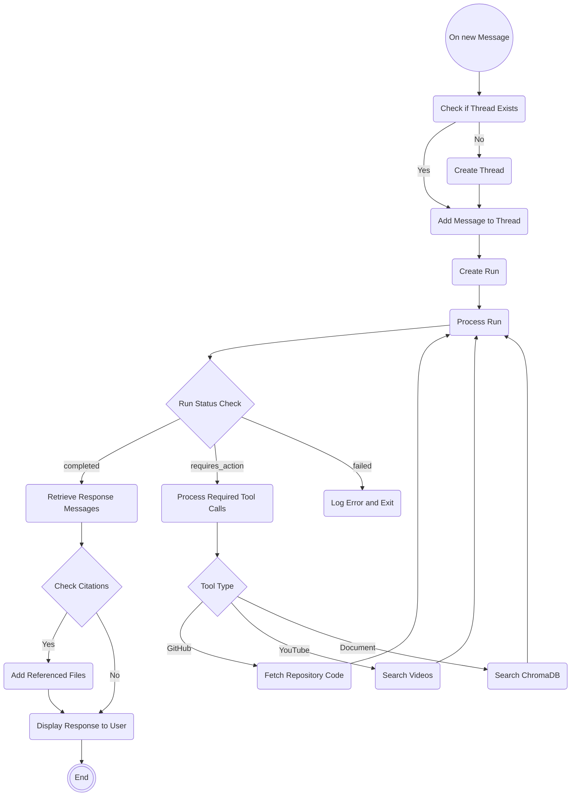

# T.i. - The Informationist: Comprehensive Technical Documentation

## Project Overview

T.i (The Informationist) is an AI-powered teaching assistant designed for Coderschool's Discord forums. The system integrates OpenAI's GPT models with Discord's interactive features to provide intelligent, contextual assistance to learners. This documentation provides a detailed technical overview of the project's architecture, components, functionality, and implementation details.

## System Architecture

The application follows a modular architecture that separates the AI assistant functionality from the Discord bot implementation:

### Core Components

1. **AI Assistant Module** (`bot/agent.py`):
   - Implements the `Assistant` class that provides the core AI functionality
   - Manages communication with OpenAI's API
   - Handles vector store creation and management through ChromaDB
   - Processes and responds to user queries

2. **Discord Bot Module** (`bot/bot.py`, `bot/extensions/*`):
   - Implements Discord integration using Hikari and Lightbulb libraries
   - Manages forum posts, threads, and user interactions
   - Routes user questions to the AI assistant and posts responses

3. **Tool Functions** (`bot/tools.py`):
   - Implements utility functions used by the assistant for specialized tasks
   - Includes GitHub repository code retrieval, YouTube search, and knowledge base search

4. **Vector Store** (`chroma/`):
   - ChromaDB-based vector database for storing and retrieving knowledge base documents
   - Enables semantic search for relevant information based on user queries

### Project Structure

```
chatbot/
├── bot/
│   ├── extensions/
│   │   ├── questions.py    # Discord client implementation for Q&A functionality
│   │   └── submission.py   # Discord client implementation for handling submissions
│   ├── schemas/
│   │   └── tool_schemas.json # Assistant tool definitions in JSON format
|   ├── __init__.py         # Package initialization and version information
|   ├── __main__.py         # Entry point for running the bot
|   ├── bot.py              # Discord bot configuration and setup
|   ├── agent.py            # Core AI assistant implementation
|   └── tools.py            # Assistant tool functions implementation
├── docs/                   # Documents for knowledge retrieval
├── chroma/                 # Vector database storage directory
├── data/
│   └── instructions.txt    # Assistant guidelines
├── .env                    # Environment variables
├── .gitignore              # Git ignore configuration
├── LICENSE                 # Project license
├── README.md               # Project overview and documentation
├── DOCUMENTATION.md        # Detailed technical documentation
├── requirements.txt        # Python dependencies
├── runtime.txt             # Python runtime specification for deployment
├── Procfile                # Deployment configuration for Heroku
└── test_agent.py           # Test script for the AI assistant
```

## Detailed Component Analysis

### AI Assistant Implementation (`bot/agent.py`)

The `Assistant` class is the central component that manages interactions with OpenAI's API:

#### Key Features:

1. **Vector Store Creation**:
   - Creates a ChromaDB vector store for document storage and retrieval
   - Processes both PDF and text files for knowledge base creation
   - Implements document chunking and ID generation for efficient retrieval

2. **Assistant Creation**:
   - Initializes an OpenAI assistant with specific instructions from the instructions.txt file
   - Loads tool schemas from a dedicated JSON file (schemas/tool_schemas.json)
   - Configures the assistant with appropriate tools and model settings

3. **Thread Management**:
   - Creates and manages OpenAI threads for conversation context
   - Maps Discord post IDs to OpenAI thread IDs for continuous conversations
   - Handles file and image uploads to OpenAI

4. **Message Processing**:
   - Processes user messages with appropriate context and attachments
   - Handles run execution and status monitoring
   - Processes tool calls and submits tool outputs back to the assistant

5. **Response Extraction**:
   - Extracts and formats assistant responses
   - Handles citations and references to external files

### Discord Integration (`bot/extensions/questions.py`)

The Discord integration is implemented through the Hikari and Lightbulb libraries:

#### Key Features:

1. **Forum Monitoring**:
   - Monitors specified forum channels for new threads and messages
   - Identifies which messages to respond to based on forum ID and message context

2. **Thread Management**:
   - Creates and manages Discord threads for user questions
   - Maps Discord threads to OpenAI assistant threads

3. **Message Handling**:
   - Processes user messages and forwards them to the AI assistant
   - Handles file and image attachments
   - Posts assistant responses back to Discord threads

4. **Feedback Collection**:
   - Implements a reaction-based feedback system
   - Allows users to rate responses from 1 to 5
   - Logs feedback to a designated staff channel

5. **TA Role Integration**:
   - Identifies TA role IDs for different forum channels
   - Skips AI responses when TAs are actively responding
   - Tags appropriate TAs for complex questions

### Submission Handling (`bot/extensions/submission.py`)

The submission extension handles exam submissions and help requests:

#### Key Features:

1. **WebSocket Integration**:
   - Connects to a FastAPI WebSocket server for real-time notifications
   - Handles submission and help request events

2. **UI Components**:
   - Implements interactive buttons using the Miru library
   - Creates views for exam submissions and help requests

3. **Notification Routing**:
   - Posts notifications to designated Discord channels
   - Provides structured information for TAs to review

4. **Task Assignment**:
   - Allows TAs to claim submissions and help requests
   - Updates messages with assignment status
   - Sends detailed information to the assigned TA

### Tools Implementation (`bot/tools.py`)

The tools module provides utility functions for the AI assistant:

#### Key Functions:

1. **GitHub Integration**:
   - `extract_owner` and `extract_repo`: Extract repository information from message text
   - `fetch_all_code_from_repo`: Retrieves code files from GitHub repositories for context

2. **Knowledge Base Search**:
   - `search_db`: Performs vector similarity search on the ChromaDB knowledge base
   - Returns formatted results with relevance scores and document excerpts

3. **YouTube Search**:
   - `search_youtube`: Finds relevant YouTube videos based on a query
   - Parses YouTube search results and extracts video links

4. **TA Role Management**:
   - `get_ta_role_for_forum`: Identifies the appropriate TA role ID for different forum channels

### Tool Schemas (`bot/schemas/tool_schemas.json`)

The tool schemas define the function signatures and parameters for the assistant's tools:

#### Defined Tools:

1. **Code Interpreter**: Enables code execution capabilities
2. **GitHub Tools**: Repository access and code retrieval functions
3. **Knowledge Base Search**: Vector database query function
4. **YouTube Search**: Video search and link retrieval
5. **TA Role Management**: Forum-specific role identification

## Data Flow

The application's data flow follows this pattern:

1. User posts a question in a Discord forum channel
2. Discord bot creates a thread and captures the initial message
3. Message is sent to the AI assistant via OpenAI's API
4. Assistant processes the message and may call required tools
5. Tool functions execute and return results to the assistant
6. Assistant generates a response based on tool outputs and context
7. Response is posted back to the Discord thread
8. For follow-up questions, the conversation continues in the same thread and OpenAI thread

### Workflow Diagram



## Technical Implementation Details

### Environment Variables

The application requires the following environment variables:
- `OPENAI_API_KEY`: API key for OpenAI services
- `DISCORD_TOKEN`: Authentication token for the Discord bot
- `GITHUB_TOKEN`: GitHub personal access token for repository access
- `GUILD_ID`: Discord server (guild) ID for bot initialization

### Vector Store Implementation

ChromaDB is used as the vector store with the following configuration:
- Documents are split into 800-character chunks with 80-character overlap
- Uses OpenAI's text-embedding-3-large model for embeddings
- Stores documents with unique IDs based on source file and page number
- Persists data to the `chroma/` directory

#### Document Processing Pipeline:
1. Documents are loaded from the `docs/` directory
2. PDF files are processed using `PyPDFDirectoryLoader`
3. Text files are read directly and converted to `Document` objects
4. Documents are split into chunks using `RecursiveCharacterTextSplitter`
5. Unique IDs are generated for each chunk using `_calculate_chunk_ids`
6. Chunks are added to the ChromaDB vector store with their IDs
7. Embeddings are generated using OpenAI's embedding model

### Discord Bot Configuration

The bot is implemented using Hikari and Lightbulb with:
- All intents enabled for comprehensive event monitoring
- Extension-based plugin architecture for modular functionality
- Miru library for interactive UI components
- WebSocket client for real-time notifications

#### Event Handlers:
- `on_thread_create`: Handles new forum threads and initializes AI responses
- `on_message_create`: Processes new messages in existing threads
- `on_reaction_add`: Manages feedback collection through reactions
- `on_started`: Initializes components like Miru client and WebSocket connections

### AI Assistant Configuration

The OpenAI assistant is configured with:
- GPT-4o model for high-quality responses
- Custom instructions from instructions.txt file
- Tool definitions loaded from schemas/tool_schemas.json
- Code interpreter capability enabled

#### Assistant Tools:
1. **Code Interpreter Tool**: Enables code execution for demonstrations
2. **GitHub Repository Tool**: Fetches code from repositories for analysis
   - Parameters: `owner`, `repo`, `path`
3. **Knowledge Base Search Tool**: Queries the vector database
   - Parameters: `query`, `k` (number of results)
4. **Repository Owner Extraction Tool**: Parses GitHub URLs
   - Parameters: `text`
5. **Repository Name Extraction Tool**: Parses GitHub URLs
   - Parameters: `text`
6. **TA Role Identification Tool**: Maps forum IDs to TA roles
   - Parameters: `forum_id`
7. **YouTube Search Tool**: Finds educational videos
   - Parameters: `query`

### Thread and Message Management

The application uses a sophisticated approach to thread management:
1. **Discord Thread Mapping**: 
   - Maps Discord thread IDs to OpenAI thread IDs in the `posts` dictionary
   - Ensures conversation continuity across multiple messages

2. **File and Image Handling**:
   - Discord attachments are categorized as images or files based on MIME type
   - Images are included directly in messages using `image_url` content type
   - Files are uploaded to OpenAI with `code_interpreter` tool access

3. **Run Processing**:
   - Continuously polls the OpenAI API for run status updates
   - Handles different run statuses (completed, requires_action, failed)
   - Implements exponential backoff for rate limiting

4. **Tool Call Processing**:
   - Parses required tool calls from the assistant
   - Executes appropriate tool functions with provided arguments
   - Submits tool outputs back to the assistant run

## Deployment Considerations

The application includes deployment files for various platforms:
- `Procfile` for Heroku deployment (specifies web dyno configuration)
- `runtime.txt` for specifying Python runtime version
- `requirements.txt` for dependency management

### Deployment Steps:
1. Set up environment variables on the hosting platform
2. Install dependencies using `pip install -r requirements.txt`
3. Initialize the application with `python -Om bot`
4. Configure appropriate scaling based on expected usage

### Docker Deployment (Alternative):
While not included in the codebase, a Docker deployment could be implemented with:
```dockerfile
FROM python:3.10-slim

WORKDIR /app

COPY requirements.txt .
RUN pip install --no-cache-dir -r requirements.txt

COPY . .

CMD ["python", "-Om", "bot"]
```

## Security Considerations

The application implements several security measures:
- Environment variables for sensitive credentials
- API token management for external services
- Role-based access control for Discord interactions
- Error handling to prevent sensitive information leakage

## User Experience Features

### Interactive Components
1. **Feedback Collection**:
   - Uses Discord reactions (1️⃣ through 5️⃣) for rating responses
   - Logs feedback to a designated staff channel
   - Helps track assistant performance over time

2. **Submission Management**:
   - Interactive buttons for accepting submissions and help requests
   - Automatic notification forwarding to assigned TAs
   - Status updates visible to all staff members

### Response Formatting
1. **Structured Responses**:
   - Clear paragraphs with headings and bullet points
   - Code blocks with syntax highlighting when providing code examples
   - Proper citations for referenced documentation

2. **Language Adaptation**:
   - Responds in the same language as the learner's question
   - Maintains consistent formatting regardless of language
   - Ensures accessibility for international students

### Special Handling for Different Question Types
1. **Exam Questions**:
   - Identifies exam questions through knowledge base search
   - Provides hints rather than complete solutions
   - Encourages learning rather than simple answer provision

2. **Platform Questions**:
   - Answers administrative questions based on knowledge base
   - Redirects complex administrative issues to staff
   - Provides clear step-by-step instructions for platform navigation

3. **Technical Questions**:
   - Analyses user code through GitHub repository integration
   - Explains concepts with appropriate level of detail
   - Provides educational resources for further learning

## Performance Optimization

### Resource Efficiency
1. **Chunking Strategy**:
   - Optimal chunk size (800 characters) balances specificity with context
   - 10% overlap (80 characters) ensures concepts aren't split at chunk boundaries
   - Improves retrieval accuracy while minimizing embedding costs

2. **Search Optimization**:
   - Uses relevance scoring to prioritize most relevant documents
   - Returns a limited number of results (default k=5) to prevent information overload
   - Formats search results with source attribution and relevance scores

### Response Time Optimization
1. **Asynchronous Processing**:
   - Implements asynchronous WebSocket client for notifications
   - Uses asynchronous event handlers for Discord events
   - Prevents blocking during long-running operations

2. **Efficient Tool Execution**:
   - Implements proper error handling for external API calls
   - Uses rate limiting awareness for GitHub and YouTube APIs
   - Provides fallback mechanisms for service disruptions

## Future Enhancement Opportunities

Potential areas for future development include:
1. Enhanced knowledge base management interface
2. Expanded tool functionality for specific educational domains
3. Improved feedback analysis and assistant training
4. Integration with additional educational platforms
5. Support for more programming languages and frameworks
6. Enhanced metrics and analytics for TA performance

## Conclusion

T.i. (The Informationist) represents a sophisticated integration of AI capabilities with Discord's community features to create an intelligent teaching assistant. The modular architecture allows for future expansion and customization while maintaining a clean separation of concerns between AI functionality and platform integration.
