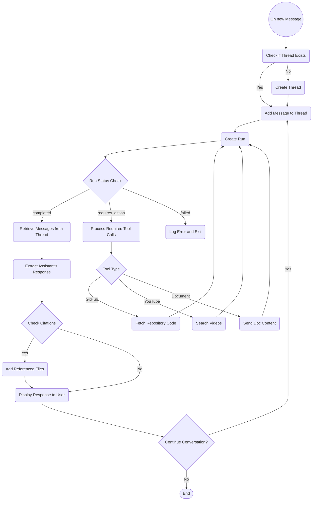

# T.i. - The Informationist


## About the project
T.i is an AI-powered teaching assistant for Coderschool's Discord forums. It combines OpenAI's GPT models with Discord's interactive features to provide intelligent, contextual assistance to learners.

## Key Features

### 🤖 Intelligent Assistance
- Multi-language support with natural, friendly communication
- Context-aware responses based on course materials and documentation
- Smart handling of follow-up questions in thread conversations

### 📝 Code Analysis
- GitHub repository integration
- Automatic code extraction and analysis
- Support for multiple programming languages
- Code review and improvement suggestions

### 📊 Visual Learning
- Image analysis for debugging visualizations
- Error identification in charts and plots
- Step-by-step guidance for fixing visual issues

### 🎓 Educational Resources
- Automatic YouTube tutorial suggestions
- Curated educational content recommendations
- Topic-specific learning materials

### 🔄 Workflow Integration
- Seamless Discord thread management
- Automatic TA tagging for complex queries
- Real-time feedback collection system
- Progress tracking and response monitoring

## Usage Examples

### Code Analysis
```python
# User asks about their GitHub repository
"I'm having trouble with my code at github.com/user/project. Can you help?"

# Bot automatically:
1. Extracts repository details
2. Fetches relevant code
3. Analyzes the implementation
4. Provides targeted feedback
```

### Visual Debugging
```python
# User shares a matplotlib visualization
"Why does my plot look weird?"

# Bot helps by:
1. Analyzing the image
2. Identifying visual issues
3. Suggesting improvements
4. Providing example code fixes
```

### Resource Recommendations
```python
# User asks about a topic
"Can you help me understand pandas DataFrame joins?"

# Bot responds with:
1. Clear explanation
2. Relevant code examples
3. Curated YouTube tutorials
4. Additional learning resources
```

### Interactive Learning
```python
# User continues the conversation
"How can I optimize this query?"

# Bot provides:
1. Step-by-step guidance
2. Performance tips
3. Best practices
4. Links to related tutorials
```

## Project Structure
```
chatbot/
├── bot/
│   ├── extensions/
│   │   └── questions.py    # Discord client implementation
|   ├── __init__.py
|   ├── __main__.py
|   ├── bot.py        
|   ├── assistant.py        # Core AI assistant implementation
|   └── tools.py            # Assistant tool definitions
├── docs/                   # Documents for knowledge retrieval
├── data/
│   └── instructions.txt    # Assistant guidelines
├── .env                    # Environment variables
├── .gitignore
├── LICENSE
├── README.md
└── requirements.txt
```

## Technical Features

### AI Integration
- OpenAI GPT models for natural language understanding
- Vector store for efficient document search
- Tool-based architecture for extensibility

### Discord Integration
- Thread-based conversations
- File and image handling
- Reaction-based feedback system
- Role-based access control

### Developer Tools
- GitHub API integration
- YouTube search capabilities
- Code analysis tools
- Documentation search

Workflow


## Installation

1. Clone and setup:
```bash
git clone https://github.com/nauqh/ti.git
cd ti
pip install -r requirements.txt
```

2. Configure environment:
```env
OPENAI_API_KEY=<Your OpenAI API Key>
DISCORD_TOKEN=<Your Discord Bot Token>
GITHUB_TOKEN=<Your GitHub Personal Access Token>
```

3. Run the bot:
```bash
python -Om bot
```

## Contributing
Contributions are welcome! See [CONTRIBUTING.md](CONTRIBUTING.md) for guidelines.

## License
This project is under the MIT License. See [LICENSE](LICENSE) for details.