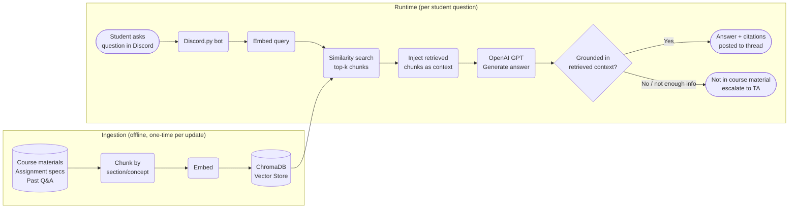
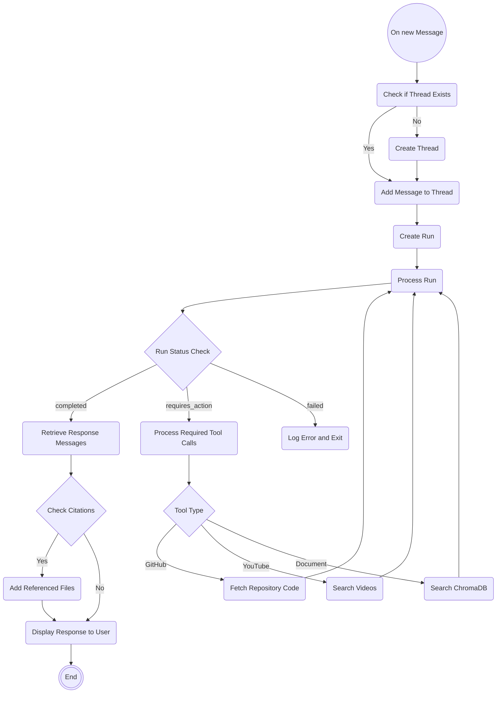

# T.i. - The Informationist


## About the project
T.i is an AI-powered teaching assistant for Coderschool's Discord forums. It's a Retrieval-Augmented Generation (RAG) system that combines OpenAI's GPT models with a ChromaDB vector store to give learners grounded, course-accurate answers — not just general programming knowledge.

Supports 100+ concurrent learners across Discord threads, with 100% positive feedback from students.

## Key Features

### 🤖 Intelligent Assistance
- Multi-language support with natural, friendly communication
- Context-aware responses based on course materials and documentation
- Smart handling of follow-up questions in thread conversations

### 📝 Code Analysis
- GitHub repository integration
- Automatic code extraction and analysis
- Support for multiple programming languages
- Code review and improvement suggestions

### 📊 Visual Learning
- Image analysis for debugging visualizations
- Error identification in charts and plots
- Step-by-step guidance for fixing visual issues

### 🎓 Educational Resources
- Automatic YouTube tutorial suggestions
- Curated educational content recommendations
- Topic-specific learning materials

### 🔄 Workflow Integration
- Seamless Discord thread management
- Automatic TA tagging for complex queries
- Real-time feedback collection system
- Progress tracking and response monitoring

## Usage Examples

### Code Analysis
```python
# User asks about their GitHub repository
"I'm having trouble with my code at github.com/user/project. Can you help?"

# Bot automatically:
1. Extracts repository details
2. Fetches relevant code
3. Analyzes the implementation
4. Provides targeted feedback
```

### Visual Debugging
```python
# User shares a matplotlib visualization
"Why does my plot look weird?"

# Bot helps by:
1. Analyzing the image
2. Identifying visual issues
3. Suggesting improvements
4. Providing example code fixes
```

### Resource Recommendations
```python
# User asks about a topic
"Can you help me understand pandas DataFrame joins?"

# Bot responds with:
1. Clear explanation
2. Relevant code examples
3. Curated YouTube tutorials
4. Additional learning resources
```

### Interactive Learning
```python
# User continues the conversation
"How can I optimize this query?"

# Bot provides:
1. Step-by-step guidance
2. Performance tips
3. Best practices
4. Links to related tutorials
```

## Project Structure
```
chatbot/
├── bot/
│   ├── extensions/
│   │   └── questions.py    # Discord client implementation
│   ├── schemas/
│   │   └── tool_schemas.json # Assistant tool definitions in JSON format
|   ├── __init__.py
|   ├── __main__.py
|   ├── bot.py        
|   ├── agent.py            # Core AI assistant implementation
|   └── tools.py            # Assistant tool functions implementation
├── docs/                   # Documents for knowledge retrieval
├── data/
│   └── instructions.txt    # Assistant guidelines
├── .env                    # Environment variables
├── .gitignore
├── LICENSE
├── README.md
└── requirements.txt
```

## Technical Features

### AI Integration
- OpenAI GPT models for natural language understanding
- ChromaDB vector store for efficient document search and retrieval
- Tool-based architecture for extensibility with schemas defined in JSON

### Discord Integration
- Thread-based conversations
- File and image handling
- Reaction-based feedback system
- Role-based access control

### Developer Tools
- GitHub API integration
- YouTube search capabilities
- Code analysis tools
- Documentation search

## Architecture

RAG pipeline, split into retrieval (finding the right course content) and augmented generation (using it to answer correctly and stay grounded):


```mermaid
graph LR
    subgraph Ingestion["Ingestion (offline, one-time per update)"]
        Docs[("Course materials\nAssignment specs\nPast Q&A")] --> Chunk(Chunk by\nsection/concept)
        Chunk --> Embed1(Embed)
        Embed1 --> DB[(ChromaDB\nVector Store)]
    end

    subgraph Runtime["Runtime (per student question)"]
        User([Student asks\nquestion in Discord]) --> Bot(Discord.py bot)
        Bot --> Embed2(Embed query)
        Embed2 --> Search(Similarity search\ntop-k chunks)
        DB --> Search
        Search --> Context(Inject retrieved\nchunks as context)
        Context --> LLM(OpenAI GPT\nGenerate answer)
        LLM --> Grounded{Grounded in\nretrieved context?}
        Grounded -->|Yes| Answer([Answer + citations\nposted to thread])
        Grounded -->|No / not enough info| Fallback([Not in course material\nescalate to TA])
    end
```

**Why this shape:** course content changes every cohort, so updating the vector store is cheap compared to retraining a model. Chunking follows the course's own structure (by section/concept) rather than fixed windows, so retrieved chunks stay coherent. Generation is instructed to answer only from retrieved chunks and fall back to "I don't have that in the course material" instead of hallucinating.

## Workflow

Runtime detail — how a message becomes a response, including tool calls (GitHub, YouTube, document search):


```mermaid
graph TD
    A((On new Message)) --> B(Check if Thread Exists)
    B -->|Yes| C(Add Message to Thread)
    B -->|No| D(Create Thread)
    D --> C
    C --> E(Create Run)
    E --> E'(Process Run)
    E' --> F{Run Status Check}
    F -->|completed| G(Retrieve Response Messages)
    F -->|requires_action| H(Process Required Tool Calls)
    H --> I{Tool Type}
    I -->|GitHub| J(Fetch Repository Code)
    I -->|YouTube| K(Search Videos)
    I -->|Document| L(Search ChromaDB)
    J --> E'
    K --> E'
    L --> E'
    F -->|failed| M(Log Error and Exit)

    G --> O{Check Citations}
    O -->|Yes| P(Add Referenced Files)
    O -->|No| Q(Display Response to User)
    P --> Q
    Q --> S(((End)))
```

## Design Decisions

Talking points behind the architecture, for anyone asking "why this way and not another":

**Why RAG over fine-tuning:** course content changes every cohort. Updating ChromaDB with new material is cheap; retraining a model per cohort isn't. RAG also keeps answers auditable, since you can point at exactly which chunk produced an answer.

**Chunking: by section/concept, not fixed token windows:** course material has real structure (headers, sections, concepts), so document-structure-aware chunking keeps each chunk semantically whole. Fixed-size chunking would risk slicing a concept in half and returning a half-explained answer.

**Embedding model:** OpenAI's embedding API, for the same reason GPT is used for generation: one vendor, one integration surface, no separate self-hosted embedding infra to run for a bounded, course-sized corpus. The same model embeds both the corpus (ingestion time) and the incoming question (query time); they have to match, or similarity search silently degrades with no obvious error.

**Why ChromaDB, not a managed vector DB (Pinecone/Weaviate):** the corpus is bounded (course docs, not web-scale), so a lightweight, self-hosted store is the better fit. Managed services add ops simplicity but also cost and complexity this scale doesn't need yet.

**Grounding / hallucination control:** generation is instructed to answer only from retrieved chunks, and to say "not in the course material" (escalating to a TA) rather than fall back on the model's general knowledge. This matters because a technically-correct-but-generic answer can still be *wrong* for a course that teaches a specific library version or approach.

**How this was evaluated:** human evaluation, via Discord reaction feedback (100% positive) and TA escalation as the fallback path, not a formal offline eval set. The honest next step would be a labeled Q&A eval set with retrieval hit-rate@k, plus an LLM-as-judge pass to catch ungrounded answers automatically; neither exists today.

**What would break first at scale:** retrieval latency and Discord API rate limits under higher concurrency, before ChromaDB itself becomes the bottleneck.

**Known gaps, worth naming proactively:**
- *Prompt injection via retrieved content:* no explicit defense against a doc/chunk containing adversarial instructions; retrieved content is trusted as data, but this isn't hardened.
- *"Lost in the middle":* with several chunks injected into one prompt, ordering isn't currently optimized (most-relevant-first/last), so a relevant chunk buried mid-context could get under-weighted.
- *No hybrid/sparse retrieval:* pure dense (vector) search can blur exact terms (library names, specific error codes) that keyword/BM25 search would catch directly.

## Installation

1. Clone and setup:
```bash
git clone https://github.com/nauqh/ti.git
cd ti
pip install -r requirements.txt
```

2. Configure environment:
```env
OPENAI_API_KEY=<Your OpenAI API Key>
DISCORD_TOKEN=<Your Discord Bot Token>
GITHUB_TOKEN=<Your GitHub Personal Access Token>
```

3. Run the bot:
```bash
python -Om bot
```

## Contributing
Contributions are welcome! See [CONTRIBUTING.md](CONTRIBUTING.md) for guidelines.

## License
This project is under the MIT License. See [LICENSE](LICENSE) for details.