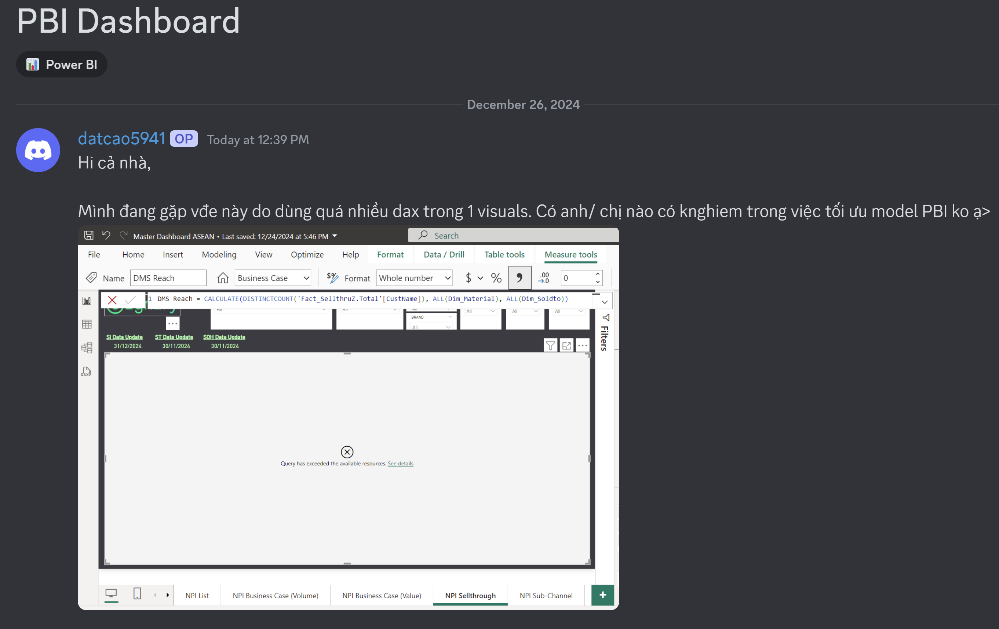
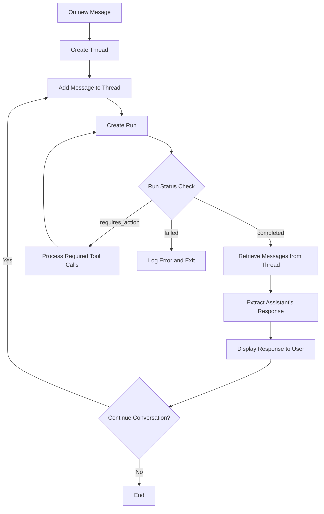

# T.i. - The Informationist


## About the project
T.i, a Coderschool's forum chatbot serves as an intelligent teaching assistant, helping learners by responding to their questions on Discord question center. 

By integrating OpenAI's GPT models with Discord's API, the chatbot automates responses, offers helpful guidance, and enhances the overall learning experience.

## Features
- **Natural Language Understanding**: Responds to learner questions in multiple languages, ensuring a friendly and concise tone.
- **GitHub Code Support**: Extracts repository details from GitHub links shared in questions and fetches relevant code for analysis.
- **Document Assistance**: References detailed instructional documents to provide accurate and context-specific responses.
- **Interactive Thread-Based Communication**: Engages in ongoing discussions in thread channels and handles follow-up questions seamlessly.
- **TA Handoff**: Tags TAs for additional clarification on complex queries, ensuring comprehensive support.

<div style="display: flex;">
  
  
</div>

## Key Components
### 1. **Bot Application**
- Built using the `hikari` and `lightbulb` libraries for Discord bot development.
- Configured with intents for interaction across Discord channels.

### 2. **AI-Powered Assistant**
- Utilizes OpenAI's GPT models to deliver accurate and engaging responses.
- Integrated tools include:
  - `extract_owner`: Extracts GitHub repository owner from thread posts.
  - `extract_repo`: Extracts GitHub repository name from thread posts.
  - `fetch_all_code_from_repo`: Retrieves code files from specified GitHub repositories.

### 3. **Thread and Message Management**
- Automatically detects new threads in specified forum channels and initiates responses.
- Handles follow-up questions while maintaining a friendly and professional tone.

### 4. Workflow for handling learner question

## Project Structure
```
bot/
├── bot.py                # Main bot application
├── agent.py              # AI assistant implementation
├── questions.py          # Question management and event listeners
├── instructions.txt      # Instructions and assistant guidelines
├── .env                  # Environment variables for configuration
└── docs/                 # Instructional and user manual documents
```

## Installation
1. Clone this repository:
   ```bash
   git clone https://github.com/<your-username>/coderschool-bot.git
   cd coderschool-bot
   ```

2. Install dependencies:
   ```bash
   pip install -r requirements.txt
   ```

3. Set up the `.env` file with the following variables:
   ```env
   TOKEN=<Your Discord Bot Token>
   GUILD_ID=<Your Discord Guild ID>
   GITHUB_TOKEN=<Your GitHub Personal Access Token>
   ```

4. Run the bot:
   ```bash
   python -Om bot
   ```

## Usage
- The bot automatically monitors specified forum channels for new threads.
- It responds to learner questions and manages ongoing discussions in threads.
- Teaching assistants are tagged for follow-ups on complex queries.

## License
This project is licensed under the MIT License. See the `LICENSE` file for more details.