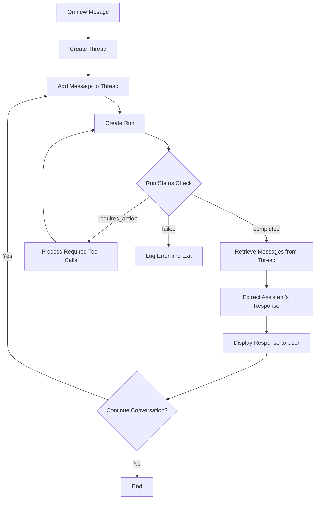

```mermaid
graph TD
    A[On new Mesage] --> B[Create Thread]
    B --> C[Add Message to Thread]
    C --> D[Create Run]
    D --> E{Run Status Check}
    E -->|completed| F[Retrieve Messages from Thread]
    E -->|requires_action| G[Process Required Tool Calls]
    G --> D
    E -->|failed| H[Log Error and Exit]

    F --> I[Extract Assistant's Response]
    I --> J[Display Response to User]
    J --> K{Continue Conversation?}
    K -->|Yes| C
    K -->|No| M[End]
```