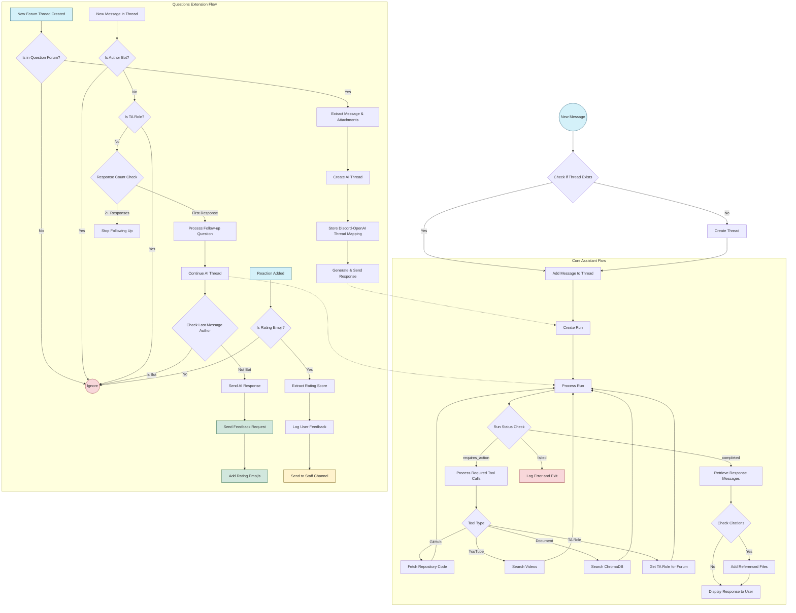

# T.i. - The Informationist: Comprehensive Technical Documentation
This section provides a high-level overview of the assistant's architecture. Understanding how the application is structured is essential for developers, administrators, and anyone who wants to customize or maintain the system.
## Project Overview

T.i (The Informationist) is an AI-powered teaching assistant designed for Coderschool's Discord forums. The system integrates OpenAI's GPT models with Discord's interactive features to provide intelligent, contextual assistance to learners. This documentation provides a detailed technical overview of the project's architecture, components, functionality, and implementation details.

## System Architecture

The system is built around two primary components that work together to provide intelligent assistance to users. For comprehensive documentation on each component, please refer to the dedicated documents: 
- **Assistant.md** for detailed information about the AI Assistant Module and its vector store implementation
- **Questions.md** for in-depth coverage of the Discord Bot Module and the questions extension functionality.

### Core Components
1. **AI Assistant Module** (`bot/agent.py`):
   - Implements the `Assistant` class that provides the core AI functionality
   - Manages communication with OpenAI's API
   - Handles vector store creation and management through ChromaDB
   - Processes and responds to user queries
   
   - **Tool Functions** (`bot/tools.py`):
     - Implements utility functions used by the assistant for specialized tasks
     - Includes GitHub repository code retrieval, YouTube search, and knowledge base search

   - **Vector Store** (`chroma/`):
     - ChromaDB-based vector database for storing and retrieving knowledge base documents
     - Enables semantic search for relevant information based on user queries

2. **Discord Bot Module** (`bot/bot.py`, `bot/extensions/`):
   - Implements Discord integration using Hikari and Lightbulb libraries
   - Manages forum posts, threads, and user interactions
   - Routes user questions to the AI assistant and posts responses

### Project Structure

```
chatbot/
├── bot/
│   ├── extensions/
│   │   ├── questions.py      # Q&A functionality
│   │   └── submission.py     # Handling submissions (comming soon)
│   ├── schemas/
│   │   └── tool_schemas.json # Assistant tool definitions in JSON format
|   ├── __init__.py           # Package initialization and version information
|   ├── __main__.py           # Entry point for running the bot
|   ├── bot.py                # Discord bot configuration and setup
|   ├── agent.py              # Core AI assistant implementation
|   └── tools.py              # Assistant tool functions implementation
├── docs/                     # Documents for knowledge retrieval
├── chroma/                   # Vector database storage directory
├── data/
│   └── instructions.txt      # Assistant system prompt, guidelines
├── .env                    
├── .gitignore             
├── LICENSE                
├── README.md                 # Project overview and documentation
├── requirements.txt          # Python dependencies
├── runtime.txt               # Python runtime specification for deployment
├── Procfile                  # Deployment configuration for Heroku
└── test_agent.py             # Test script for the AI assistant
```

## Brief Component Description

### 1. AI Assistant Module (`bot/agent.py`)

The `Assistant` class is the central component that manages interactions with OpenAI's API:

#### Key Features:

1. **Vector Store Creation**:
   - Creates a ChromaDB vector store for document storage and retrieval
   - Processes both PDF and text files for knowledge base creation
   - Implements document chunking and ID generation for efficient retrieval

2. **Assistant Creation**:
   - Initializes an OpenAI assistant with specific instructions from the instructions.txt file
   - Loads tool schemas from a dedicated JSON file (schemas/tool_schemas.json)
   - Configures the assistant with appropriate tools and model settings

3. **Thread Management**:
   - Creates and manages OpenAI threads for conversation context
   - Maps Discord post IDs to OpenAI thread IDs for continuous conversations
   - Handles file and image uploads to OpenAI

4. **Message Processing**:
   - Processes user messages with appropriate context and attachments
   - Handles run execution and status monitoring
   - Processes tool calls and submits tool outputs back to the assistant

5. **Response Extraction**:
   - Extracts and formats assistant responses
   - Handles citations and references to external files

### 2. Discord Bot Module (`bot/extensions/questions.py`)

The Discord integration is implemented through the Hikari and Lightbulb libraries:

#### Key Features:

1. **Forum Monitoring**:
   - Monitors specified forum channels for new threads and messages
   - Identifies which messages to respond to based on forum ID and message context

2. **Thread Management**:
   - Creates and manages Discord threads for user questions
   - Maps Discord threads to OpenAI assistant threads

3. **Message Handling**:
   - Processes user messages and forwards them to the AI assistant
   - Handles file and image attachments
   - Post assistant responses back to Discord threads

4. **Feedback Collection**:
   - Implements a reaction-based feedback system
   - Allows users to rate responses from 1 to 5
   - Logs feedback to a designated staff channel

5. **TA Role Integration**:
   - Identifies TA role IDs for different forum channels
   - Skips AI responses when TAs are actively responding
   - Tags appropriate TAs for complex questions

### 3. Tools Implementation (`bot/tools.py`)

The tools module provides utility functions for the AI assistant:

#### Key Functions:

1. **GitHub Integration**:
   - `extract_owner` and `extract_repo`: Extract repository information from message text
   - `fetch_all_code_from_repo`: Retrieves code files from GitHub repositories for context

2. **Knowledge Base Search**:
   - `search_db`: Performs vector similarity search on the ChromaDB knowledge base
   - Returns formatted results with relevance scores and document excerpts

3. **YouTube Search**:
   - `search_youtube`: Finds relevant YouTube videos based on a query
   - Parses YouTube search results and extracts video links

4. **TA Role Management**:
   - `get_ta_role_for_forum`: Identifies the appropriate TA role ID for different forum channels

## Workflow

The application's data flow follows this pattern:

1. User posts a question on a Discord forum channel
2. Discord bot creates a thread and captures the initial message
3. Message is sent to the AI assistant via OpenAI's API
4. Assistant processes the message and may call required tools
5. Tool functions execute and return results to the assistant
6. Assistant generates a response based on tool outputs and context
7. Response is posted back to the Discord thread
8. For follow-up questions, the conversation continues in the same thread and OpenAI thread

The following diagram illustrates the complete workflow of the system, including both the core AI assistant functionality and the Questions extension integration:


## Integration Points

### Discord Integration

The system integrates with Discord through:
- Forum thread monitoring
- Message event handlers
- Thread creation and management
- Attachment processing

### OpenAI Integration

The system integrates with OpenAI through:
- Assistant API for message handling
- Embeddings API for vector database
- Files API for attachment handling
- Beta features for advanced capabilities

### GitHub Integration

Repository access is configured through:
- GitHub API with personal access token
- Repository content retrieval
- Code analysis capabilities

## Performance Optimization
1. **Chunking Strategy**:
   - Optimal chunk size (800 characters) balances specificity with context
   - 10% overlap (80 characters) ensures context isn't split at chunk boundaries
   - Improves retrieval accuracy while minimizing embedding costs

2. **Search Optimization**:
   - Uses relevance scoring to prioritize most relevant documents
   - Returns a limited number of results (default k=5) to prevent information overload
   - Formats search results with source attribution and relevance scores

3. **Efficient Tool Execution**:
   - Implements proper error handling for external API calls
   - Uses rate limiting awareness for GitHub and YouTube APIs
   - Provides fallback mechanisms for service disruptions

