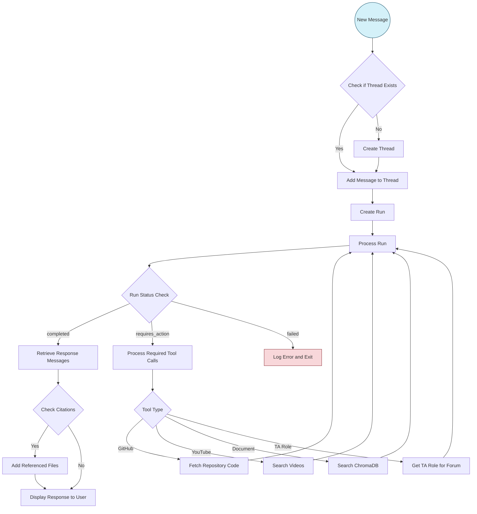

# Assistant Module Documentation

## Overview
The `Assistant` class is the core AI component of the T.i chatbot system, providing a unified interface for managing conversations with OpenAI's API. It handles document storage, retrieval, thread management, and tool execution to deliver contextually relevant responses to user queries.

## Core Features
1. **Knowledge Management**
   - Integrated ChromaDB vector storage for document embedding
   - Automatic document chunking and indexing
   - Support for PDF and text document processing

2. **Conversation Management**
   - Thread-based conversation handling
   - Mapping between Discord posts and OpenAI threads
   - Support for multi-turn interactions

3. **Tool Integration**
   - GitHub repository code retrieval
   - YouTube search functionality
   - Vector database semantic search
   - Discord role and forum management

4. **Content Processing**
   - File and image attachment handling
   - Citation tracking and extraction
   - Response formatting and cleanup

## Implementation Details

### Initialization
```python
def __init__(self, file_paths=None):
    self.client = OpenAI()
    self.posts = {}  # Maps Discord post IDs to OpenAI thread IDs

    self.CHROMA_PATH = "chroma"
    self.create_vector_store(file_paths)
    with open("instructions.txt", "r") as file:
        instructions = file.read()
    self.create_assistant(instructions)
```

The Assistant initializes with optional document paths, creates a vector store, and configures the OpenAI assistant with instructions from a text file.

### Vector Store Creation
The `create_vector_store` method processes documents, splits them into manageable chunks, and adds them to a ChromaDB vector store:

```python
def create_vector_store(self, file_paths):
    # Clear existing database
    # Initialize embedding function with OpenAI
    # Process PDF directories and non-PDF files separately
    # Split documents into chunks
    # Calculate unique IDs for chunks
    # Add to vector store
```

This enables semantic search across course materials, guides, and other documentation.

### Thread and Message Management
The Assistant maintains a mapping between Discord post IDs and OpenAI thread IDs:

```python
# Create a thread from a Discord message
thread = assistant.create_thread(message=message.content, forum_id=forum_id)
assistant.posts[post_id] = thread.id

# Continue a conversation
response, citations = assistant.continue_thread(
    message=follow_up_question,
    post_id=post_id
)
```

### Tool Function Calling
The Assistant manages tool execution through an integrated function calling system:

```python
def call_required_functions(self, run, required_actions: dict, thread_id):
    # Extract function name and arguments
    # Call appropriate function based on name
    # Return results to the assistant
```

Available tools include:
- `fetch_all_code_from_repo`: Retrieves code from GitHub repositories
- `extract_owner` and `extract_repo`: Parse GitHub repository details
- `get_ta_role_for_forum`: Maps forum IDs to TA roles
- `search_youtube`: Finds relevant educational videos
- `search_db`: Performs semantic search on the document database

## Workflow Diagram

The core Assistant workflow follows this pattern:



## Key Components

### Thread Management
The Assistant maintains conversations through OpenAI's thread API:
- `create_thread`: Initializes a new conversation thread
- `add_message`: Appends messages to existing threads
- `continue_thread`: Continues an existing thread with new input

### Run Processing
Each conversation turn involves creating and processing a "run":
- `create_and_run_thread`: Creates and processes an initial run
- `_handle_run`: Monitors run status and handles tool calls
- `extract_response`: Extracts and formats the final response

### File Handling
The Assistant manages attachments and file uploads:
- `upload_file`: Uploads files to OpenAI's API
- `_prepare_attachments`: Prepares file attachments for messages
- `_prepare_content`: Formats message content including text and images

## Testing the Assistant

The Assistant can be tested using the `test_agent.py` script, which runs through predefined scenarios:

```python
# Initialize the assistant with documentation
assistant = Assistant(file_paths)

# Test different scenarios
run_test_scenario(assistant, 1, "How many modules will I be learning in the Data Science course?")
run_test_scenario(assistant, 2, "I want to learn about AI engineering", "How can I implement my own assistant?")
```

Test scenarios include:
1. Course content questions (using vector search)
2. Resource recommendations
3. Exam question handling
4. GitHub repository explanation

## Integration Points

### Questions Extension
The Assistant integrates with the Questions extension through:
- Shared thread management
- Forum-specific role identification
- Response generation for forum posts

### Discord Bot
Integration with the Discord bot happens via:
- Thread mapping between Discord and OpenAI
- File and image attachment processing
- Response formatting and citation handling

## Advanced Usage

### Custom Tool Integration
New tools can be added by:
1. Adding tool schema to `tool_schemas.json`
2. Implementing the tool function in `tools.py`
3. Adding the function to the `call_required_functions` method

### Document Management
The Assistant supports various document types:
- PDF processing via PyPDFDirectoryLoader
- Text file processing with metadata extraction
- Recursive document chunking with optimized overlap

## Error Handling

The Assistant implements robust error handling:
- Rate limit detection for GitHub repositories
- File download and processing errors
- Run status monitoring and timeout handling
- Tool execution exception management