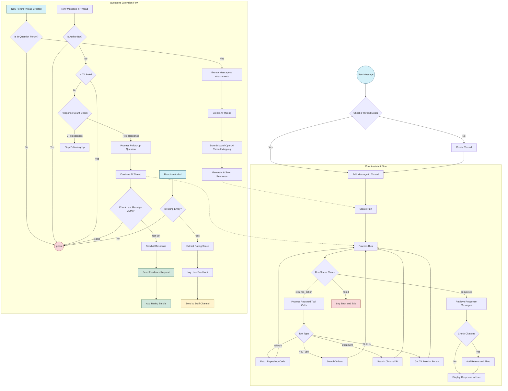
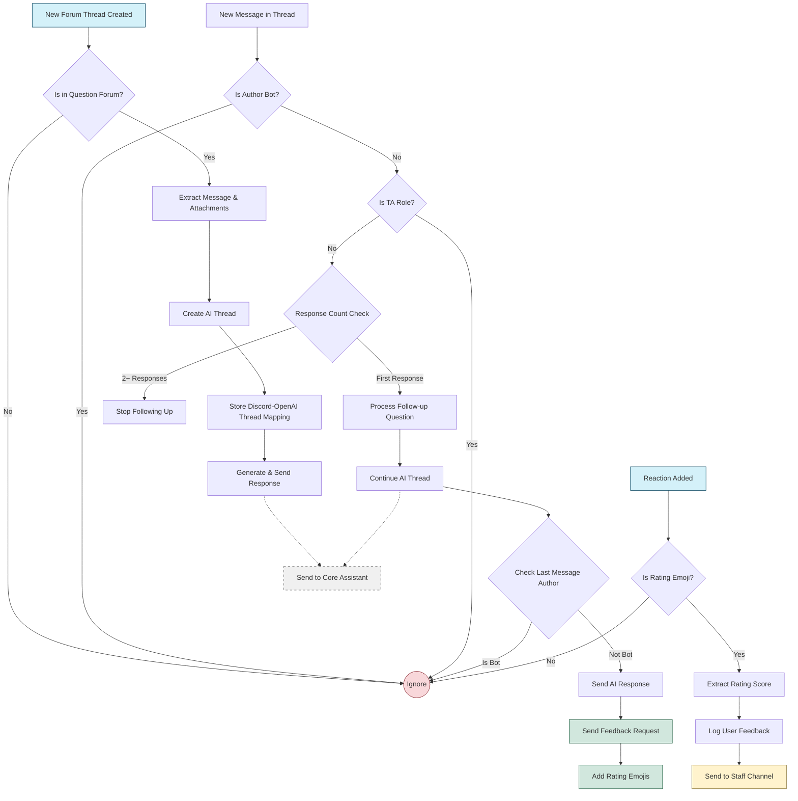
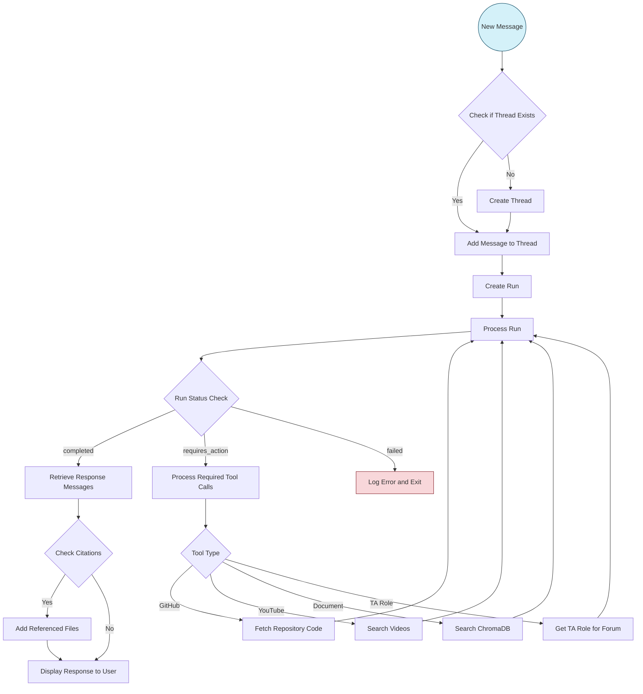

# Merged Workflow Diagram

The following diagram illustrates the complete workflow of the T.i chatbot system, including both the core AI assistant functionality and the Questions extension integration:

## Creating Partial Diagrams

This unified diagram has been designed to allow for displaying partial views in different documentation files:

### 1. Complete Diagram (for README.md)
The complete diagram shown above includes both the Core Assistant flow and the Questions Extension flow, with clear connections between them.

### 2. Questions Extension Only (for questions.md)
To display only the Questions Extension portion of the diagram, you can extract just that subgraph section and add a reference to the Core Assistant like this:

### 3. Core Assistant Only
Similarly, you could create a view showing only the Core Assistant flow:

## Maintainability Note

The diagrams have been organized with consistent node naming and structure so that changes to the unified diagram can be easily propagated to partial views. When updating the workflow:

1. First update the complete diagram in this file
2. Then update the partial diagrams in their respective documentation files
3. Maintain consistent node IDs and naming conventions
4. Keep section comments (like `%% Thread Creation Flow`) to make extraction easier
