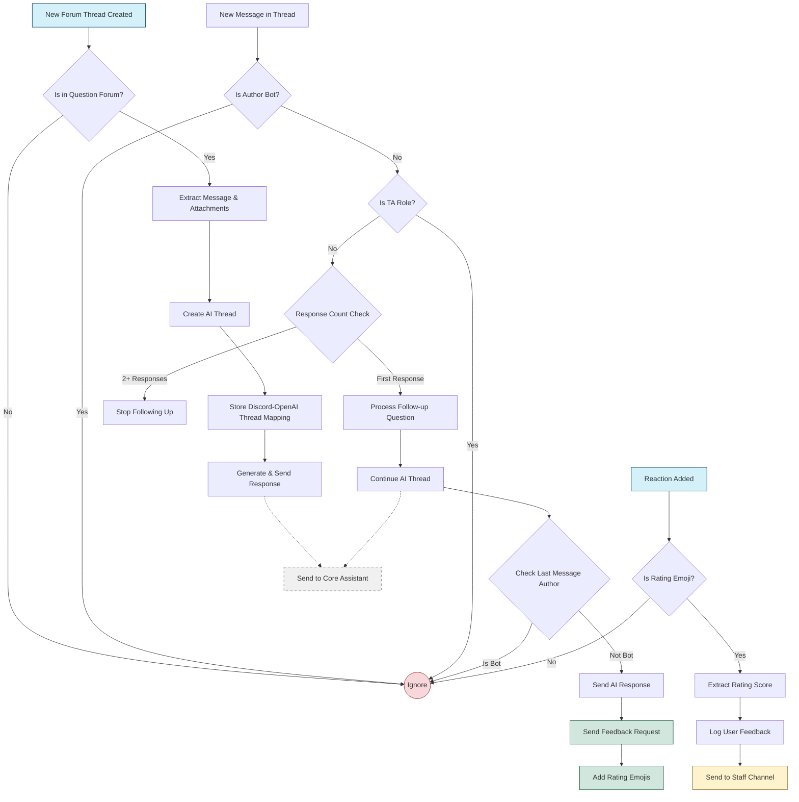

# Questions Extension Documentation

## Overview
The `questions.py` extension implements a forum-based Q&A system for the Discord bot, providing automated responses to student questions across different course forums. This extension connects Discord's forum threads with the OpenAI-powered assistant to deliver contextually relevant answers.

## Core Features
1. **Forum Integration**
   - Monitors designated question forums for new threads
   - Automatically responds to new questions with AI-powered answers
   - Supports follow-up questions with conversation continuity
2. **Multi-Course Support**
   - Configurable forum mapping for different courses (Data Science, Full Stack Web, CS50)
   - Course-specific TA role identification
   - Custom notification channels for each course
3. **Attachment Handling**
   - Processes both image and file attachments
   - Routes images to visual context for the assistant
   - Handles code files, PDFs, and other documents
4. **Feedback Collection**
   - Interactive rating system through emoji reactions (1-5 scale)
   - Automatic feedback prompt after each response
   - Centralized feedback logging to staff channels
5. **TA Integration**
   - TA role detection to avoid conflicting with human TAs
   - Automatic forum routing based on course categories
   - Staff notification system for assistance needs

## Implementation Details
### Configuration
```python
QUESTION_CENTERS = {
    "DS": {"forum_id": 1081063200377806899, "ta_id": 1194665960376901773, "staff_channel": 1237424754739253279},
    "FSW": {"forum_id": 1326478786274922568, "ta_id": 912553106124972083},
    "CS50": {"forum_id": 1343930405702865037, "ta_id": 1233260164233297942},
}
```
The extension uses a mapping dictionary to track forum IDs, TA role IDs, and staff channels for different courses.

### Initialization
```python
@plugin.listener(hikari.StartingEvent)
async def on_starting(event: hikari.StartingEvent) -> None:
    bot = Assistant([f"docs/{filename}" for filename in os.listdir('docs')])
    plugin.app.d.bot = bot
```
On startup, the extension initializes the `Assistant` with all documents from the `docs` directory, setting up the knowledge base for responses.

### Thread Creation Flow
1. The extension listens to new forum threads in designated forums
2. When detected, it extracts message content and attachments
3. Creates a corresponding AI thread via the Assistant
4. Maps the Discord thread ID to the OpenAI thread ID for continuity
5. Sends the AI's response back to the Discord thread

### Follow-up Question Handling
The extension handles follow-up questions by:
```python
async def handle_follow_up(post: hikari.GuildThreadChannel, message: hikari.Message) -> None:
    # Process follow-up questions and collect feedback
```
1. Continuing the existing AI thread using stored mapping
2. Preventing duplicate responses with history checks
3. Adding feedback collection after each response
4. IMPORTANT: Limiting responses to **2 per thread** to avoid excessive replies

### Feedback Collection
```python
@plugin.listener(hikari.ReactionAddEvent)
async def on_reaction_add(event: hikari.ReactionAddEvent) -> None:
    # Handle feedback reactions (1-5 scale)
```
The feedback system:
1. Monitors reactions to feedback messages
2. Identifies numeric ratings (1-5)
3. Logs ratings to a designated staff channel with user information
4. Creates a clickable thread link for staff follow-up


## Workflow
1. Student creates a new question in a course forum
2. Bot automatically processes the question and responds
3. Student can ask one follow-up question for clarification
4. Student can rate the helpfulness of the responses
5. TAs can step in at any point to provide additional help

The following diagram illustrates the workflow of the components in the Questions extension:



### Event Listeners
- `on_starting`: Initializes the Assistant with documents 
- `on_thread_create`: Handles new forum threads
- `on_message_create`: Processes follow-up messages
- `on_reaction_add`: Collects user feedback

### Core Functions
- `handle_post_creation`: Processes initial questions
- `handle_follow_up`: Manages follow-up interactions
- `QUESTION_CENTERS` dictionary: Maps course forums to TA roles
